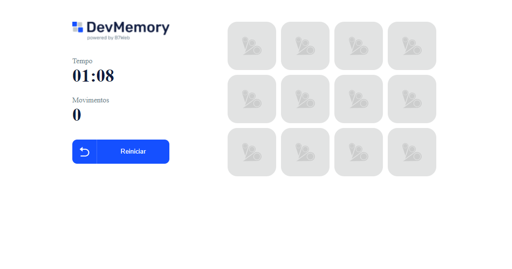
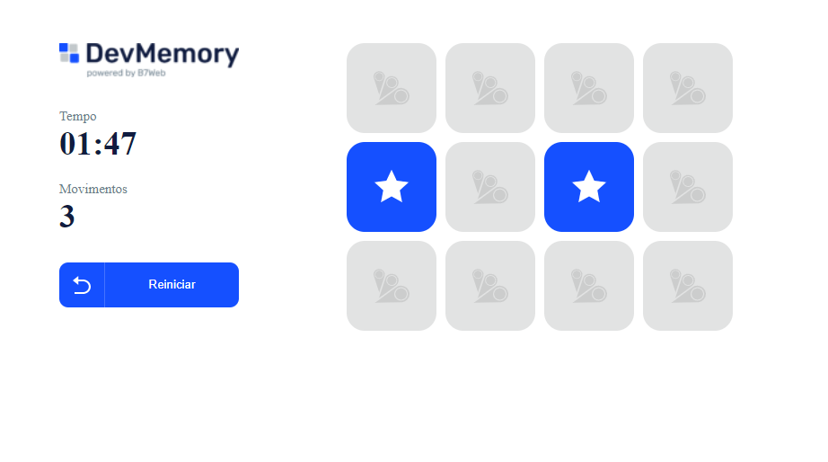
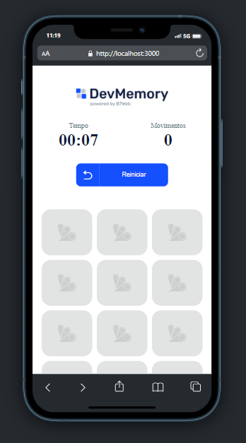
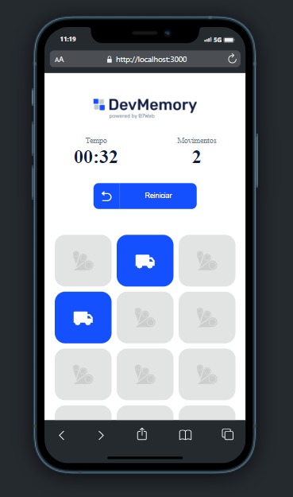

# DevMemory 

## Descrição:

-> Este projeto é um módulo das classes React do B7Web. Neste projeto eu me concentro em praticar minha organização de pastas e o uso dos princípios do React.

[x] Assets -> Pasta responsável por conter as imagens e ícones utilizados nos projetos.  
[x] Components -> Pasta contendo os componentes do projeto. 
[x] Helpers -> Contém minhas funções customizadas que são usadas na home. 
[x] Pages -> Região que contém as páginas do projeto. 
[x] Styles -> Região que contém todos os estilos do projeto. 

### Assets:

-> Nesse caso, essa pasta contém apenas os ícones utilizados. No caso, deslike, like, seta e ícone da logo.

### Components: 

-> Button.tsx é um botão customizado para efetuar o reset do jogo.  
-> GridItem.tsx é responsável por modelar os cartões do jogo. Ele recebe os dados de cada item do jogo e a função quando efetuar o click.  
-> InfoItem.tsx é responsável por organizar as informações do lado esquerdo da home.tsx.

### Helpers: 

-> formatTimeElapsed.ts faz a formatação da contagem de tempo.

### Pages:

-> Ele contém apenas uma página, a home neste caso, que é responsável por estruturar o app.

### OBS: 

Este projeto é responsivo.

